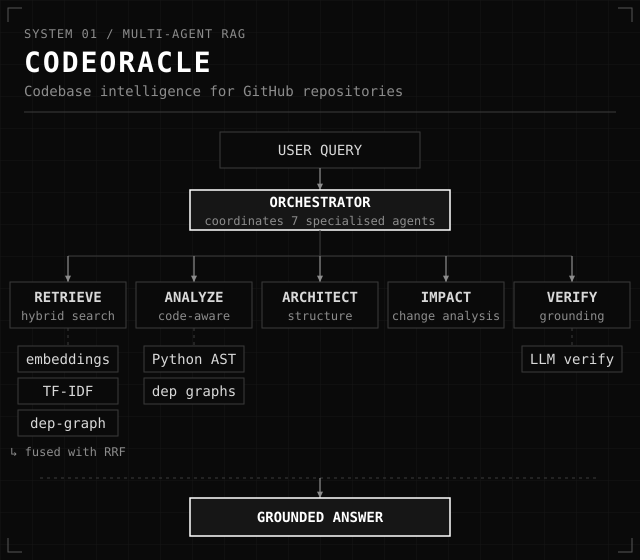
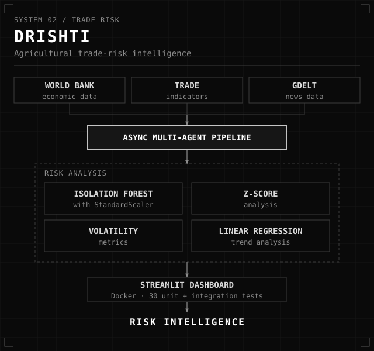
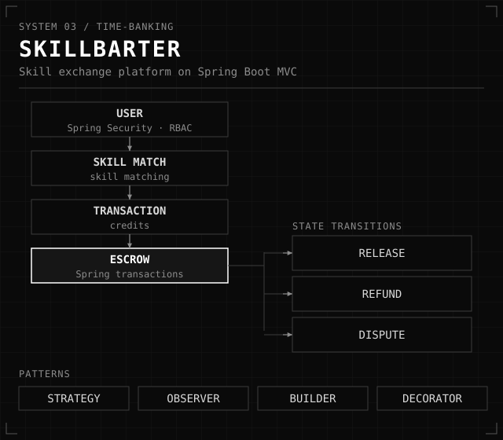

<p align="center">
  
</p>

```text
SYSTEM STATUS    ONLINE
FOCUS            AI · RAG · AGENTS · SYSTEMS
BUILD            2026
```

<br>

## 01 / SYSTEM

I build software where reasoning, retrieval, data and automation meet.
Most of my work sits between a model and the problem around it: pulling in the right context, checking answers against evidence, and wrapping it all in software that holds together.

Final-year Computer Science at PES University, Bangalore. Previously an AI intern at CellStrat, working on healthcare data pipelines and inference performance.

<br>

## 02 / FEATURED SYSTEMS

### [CodeOracle](https://github.com/VedanthRai/Codebase)
**Multi-agent RAG for understanding GitHub repositories.**



- Seven specialized agents cover code retrieval, analysis, architecture, impact analysis and verification.
- Hybrid retrieval combines semantic embeddings, TF-IDF keyword search and dependency-graph expansion, merged with Reciprocal Rank Fusion.
- Python AST and dependency graphs drive static analysis; LLM-based verification grounds answers in the retrieved code.

<br>

### [Drishti](https://github.com/VedanthRai/Drishti)
**Trade-risk intelligence for agriculture.**



- Asynchronous multi-agent pipeline over World Bank economic data, trade indicators and GDELT news.
- Anomaly detection with StandardScaler and Isolation Forest, plus Z-scores, volatility metrics and linear-regression trends.
- Streamlit dashboard, Docker deployment and a 30-test unit and integration suite.

<br>

### [SkillBarter](https://github.com/VedanthRai/SkillBarter)
**A time-banking platform for exchanging skills.**



- Full-stack Spring Boot MVC with JPA persistence, sessions, skill matching, notifications and Spring Security role-based access.
- Credit escrow runs as a transactional workflow: escrow, release, refund and dispute resolution.
- Strategy, Observer, Builder and Decorator patterns keep the architecture extensible.

<br>

## 03 / ENGINEERING DNA

| Layer | Stack |
| :-- | :-- |
| **Systems** | C · C++ · Python · OOP · OS · DSA |
| **Intelligence** | LLMs · Ollama · RAG · Multi-agent systems · PyTorch · Scikit-learn |
| **Data** | SQL · MySQL · SQLite · ChromaDB |
| **Applications** | Spring Boot · Streamlit · Docker · APIs |
| **Tools** | GitHub · VS Code · Jupyter · Google Colab |

<br>

## 04 / MISSION LOG

```text
[01] NIMBUS 1000              1ST PLACE
[02] AGENTATHON 2026          3RD PLACE
[03] GOOD CODER COMPETITION   TOP 50
[04] RBCCPS · IISC BANGALORE  INTERNSHIP
```

<br>

## 05 / CONNECT

[LinkedIn](https://www.linkedin.com/in/vedanthrai) · [Email](mailto:vedanthrai01@gmail.com) · [Portfolio](https://celadon-yeot-685eab.netlify.app/) · [GitHub](https://github.com/VedanthRai)

*Make it work. Make it grounded. Then make it simple.*
